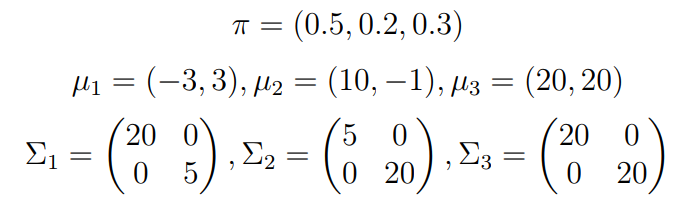
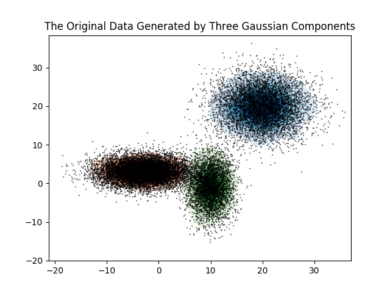
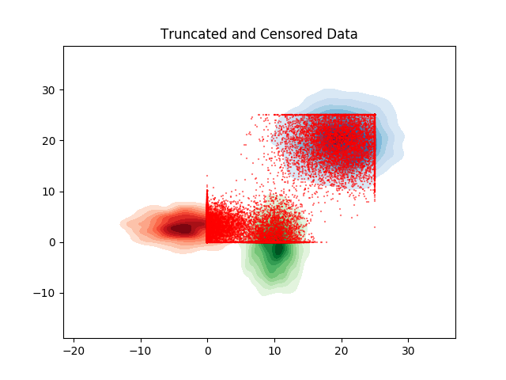
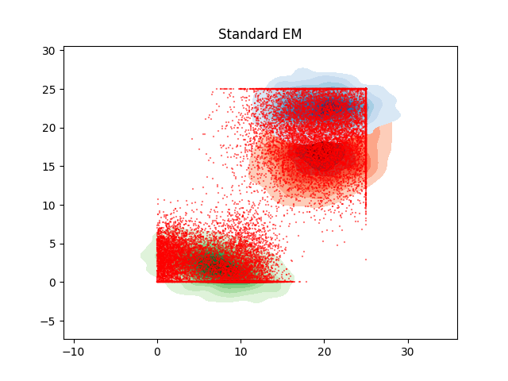
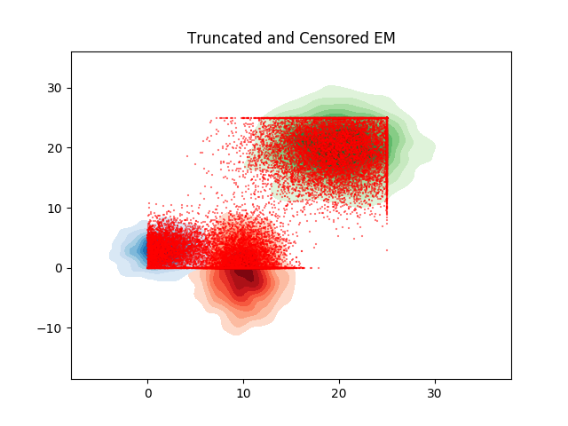

# EM Algorithm for Truncated and Censored Data

This repo contains a python implementation of the paper

**EM algorithms for multivariate Gaussian mixture models with truncated and censored data**. Lee, G., & Scott, C. (2012). *Computational Statistics & Data Analysis*, 56(9), 2816-2829.

## Requirements
- python3.6
- numpy
- scikit-learn
- scipy
- matplotlib
- seaborn

## Experiment
In order to conduct experiments regarding EM alogrithm for truncated and censored data, please define your Gaussian Mixture Model and truncation and censoring bounds in the file `main.py`. Consequencely, execute the following command to start the experiments.

```bash
python main.py
```

For example, the default codes in the main file was designed with three-component bivariate Gaussian mixtures. An observation (x1, x2) was limited to a rectangular window [0, 25] x [0, 25] and truncated at 0 on the first dimension. Two centroids are located outside the window

<p align="center">
  
</p>

The original data points are depicted in the following figures. In each figure, level contoursare displayed to compare the estimated distributions to the true distribution.

<p align="center">
  
</p>

<p align="center">
  
</p>

The mixture models fitted by the standard EM and the truncated and censored data EM are shown in the below figures. The estimates from the truncated and censored data EM algorithm significantly outperform the estimates from the standard EM algorithm. The two component centers from the truncated and censored data EM algorithm were located outside the observation window. On contrary, the standard EM failed to find censored centroids correctly.

<p align="center">
  
</p>

<p align="center">
  
</p>
